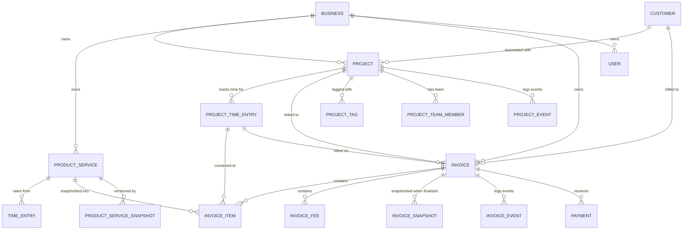

# Functional Specification: Projects and Services Module

**Version:** 1.0  
**Date:** 2026-09-17  
**Status:** Specification  
**Product Area:** Project & Work Management, Catalog, Billing  
**Aligned With:** InvoiceFlow Universal Invoice Generator (React 18 / Express + TypeScript / PostgreSQL / Tailwind CSS v4)

---

## Table of Contents

1. [Overview](#1-overview)
2. [Projects Management System](#2-projects-management-system)
   - 2.1 [Organization & Status Model](#21-organization--status-model)
   - 2.2 [Project Listing Data Fields](#22-project-listing-data-fields)
   - 2.3 [Project Detail Dashboard](#23-project-detail-dashboard)
   - 2.4 [Time Tracking](#24-time-tracking)
3. [Services Catalog](#3-services-catalog)
   - 3.1 [Catalog Functionality](#31-catalog-functionality)
   - 3.2 [Catalog Data Fields](#32-catalog-data-fields)
   - 3.3 [Invoice Creation Integration](#33-invoice-creation-integration)
4. [End-to-End Workflow](#4-end-to-end-workflow)
5. [Data Model Relationships](#5-data-model-relationships)
6. [Appendix](#6-appendix)

---

## 1. Overview

The **Projects and Services** module provides a centralized workspace for organizing client work, managing reusable service offerings, and converting billable time and materials into invoices — all with real-time financial visibility.

The module is composed of two interconnected subsystems:

| Subsystem | Purpose | Key Files |
|---|---|---|
| **Projects Management** | Organize client work into tracked units with statuses, budgets, teams, and activity logs | `src/services/project-service.ts` | `src/repositories/project.repo.ts` | `src/db/migrations/012_projects.sql` |
| **Services Catalog** | Maintain a reusable library of standardized products and services for fast invoice creation | `src/services/product-service/` | `src/repositories/product-service.repo.ts` | `src/db/migrations/010_product_service_catalog.sql` |

**Core design principles:**
1. **Tenant isolation** — every database query is scoped to a `business_id` / `tenant_id`.
2. **Atomic financial updates** — project financial aggregates (amount_invoiced, amount_paid) are updated by the invoice service inside the same transaction as invoice finalization.
3. **Immutability** — finalized invoices are snapshotted; catalog entries snapshot at invoice creation time.
4. **Backend-authoritative calculations** — all monetary calculations are performed server-side using `decimal.js`; the frontend mirrors logic for responsiveness but defers to the backend as source of truth.

> **Status legend:** Items marked **DONE** are already implemented in this codebase. Items marked **NEW** are specified for future implementation.

---

## 2. Projects Management System

### 2.1 Organization & Status Model — DONE

Projects are organized into a five-state lifecycle that reflects the natural progression of client work:

| Status | Description | Key Behaviors |
|---|---|---|
| **Planning** | Project scoped but not yet active. Budget may still be negotiated. | Default status on creation. Can transition to `active` or `on_hold`. |
| **Active** | Work is in progress. Time entries, invoices, and payments accumulate. | Primary working state. Can transition to `completed`, `on_hold`, or back to `planning`. |
| **On Hold** | Work is paused — e.g., waiting on client feedback or deliverables. | Time tracking pauses (configurable). Can return to `active`. |
| **Completed** | All work is finished. Invoices issued and (ideally) paid. | No new time entries. Can still archive. |
| **Archived** | Project is inactive and hidden from default views. | Read-only. Cannot transition out except via explicit "Restore," which returns to `planning`. |

**Status transition rules** (enforced in `ProjectService.updateStatus`):

```
planning ──► active ──► completed ──► archived
   │            │           │
   │            │           └──────────► (terminal)
   │            │
   │            └──► on_hold ◄──► active
   │
   └──► archived (via archive action)
```

- **Archived projects** are excluded from all default project lists unless `includeArchived=true` is explicitly passed.
- **Archived projects cannot have their status changed** — they must be restored first, which sets status back to `planning`.
- **Deletion** is only permitted for archived projects; attempting to delete a non-archived project returns a `BusinessLogicError`.

**Status filtering** is supported in the project list with these UI filter options:
- All Statuses
- Planning, Active, On Hold, Completed
- Show archived (checkbox)

**Backend implementation:** The `status` column uses a PostgreSQL `project_status` ENUM. `ProjectStatusSchema` (Zod) enforces the allowed values at the DTO layer.

### 2.2 Project Listing Data Fields — DONE

The project listing view displays the following fields for each project, sourced from `ProjectListItem`:

| Field | Source Column | Type | Notes |
|---|---|---|---|
| **Project Name** | `name` | `VARCHAR(255)` | Required, searchable via `search_name` |
| **Customer** | `customers.name` (joined) | `VARCHAR` | Nullable; displayed as customer name; filtered via `ProjectList.customerName` |
| **Status** | `status` | `project_status ENUM` | Displayed as a colored badge via `ProjectStatusBadge` |
| **Start Date** | `start_date` | `DATE` | Optional; shown in detail view. Sortable. |
| **Due Date** | `due_date` | `DATE` | Optional; sortable column in list view |
| **Total Value / Budget** | `budget` | `NUMERIC(18,6)` | Represents the total project value or budget cap |
| **Amount Invoiced** | `amount_invoiced` | `NUMERIC(18,6)` | Running total of all finalized invoices for this project |
| **Amount Paid** | `amount_paid` | `NUMERIC(18,6)` | Running total of all payments applied to this project's invoices |
| **Outstanding Balance** | *computed* | `DECIMAL` | `amount_invoiced - amount_paid` — displayed in the project detail dashboard |
| **Outstanding (Billable)** | `remaining_billable` | `NUMERIC(18,6)` | `budget - amount_invoiced` — remaining budget that can be invoiced |
| **Tags** | `project_tags` (joined) | `JSONB[]` | Displayed as colored badges in the list view |
| **Team Members** | `project_team_members` (joined) | `INTEGER` | Count displayed as a number badge |

**Computed fields in the listing:**
- `outstanding` (amount still owed): calculated as `amount_invoiced - amount_paid`.
- `budget_utilization`: `amount_invoiced / budget * 100` — shown as a percentage in the financial summary.
- `tag_count` and `team_member_count` are returned as aggregate columns.

**Searching & Sorting** are supported on:
- Search: name (full-text via `ILIKE` on `search_name` and `search_desc`)
- Sort by: name, created_at, updated_at, due_date, start_date, budget, amount_invoiced
- Direction: asc/desc

**Backend implementation:** `ProjectRepository.findMany()` builds dynamic SQL with tenant-scoped conditions. `ProjectListItem` extends `Project` with `customerName`, `customerEmail`, `tagCount`, and `teamMemberCount`.

### 2.3 Project Detail Dashboard — DONE

The project detail view (`webapp/src/pages/ProjectDetail.tsx`) provides a tabbed dashboard with an overview of all project-associated entities.

**Layout structure:**
```
┌─────────────────────────────────────────────────────┐
│  ← Back       [Project Name]          [Edit] [Archive] [Delete] │
├─────────────────────────────────────────────────────┤
│ Project header: name, status badge, customer, dates │
├─────────────────────────────────────────────────────┤
│  Overview  │ Invoices  │ Activity  │ Time (NEW)  │ Notes (NEW) │
├─────────────────────────────────────────────────────┤
│                                                     │
│  ┌──────────────────────────────────────────────┐  │
│  │  Financial Summary Cards (3-column grid)    │  │
│  │  [Budget] [Status] [Financial Summary]      │  │
│  └──────────────────────────────────────────────┘  │
│                                                     │
│  ┌──────────────────────────────────────────────┐  │
│  │  Tags                                        │  │
│  │  [Tag 1] [Tag 2]  (+ Add tag)               │  │
│  └──────────────────────────────────────────────┘  │
│                                                     │
│  ┌──────────────────────────────────────────────┐  │
│  │  Actions                                     │  │
│  │  [Create Invoice] (PRIMARY CTA)              │  │
│  │  [Log Time] (NEW, when billing = hourly)     │  │
│  └──────────────────────────────────────────────┘  │
└─────────────────────────────────────────────────────┘
```

#### Financial Summary Cards

| Card | Display | Data Source |
|---|---|---|
| **Budget** | Formatted currency (e.g., `$50,000.00 USD`) | `Project.budget` |
| **Status** | Editable dropdown with 4 options (planning, active, on_hold, completed) | `Project.status` |
| **Financial Summary** | "X invoiced · Y paid · Z outstanding" with progress bar | `ProjectFinancialSummary` |

The financial summary uses `ProjectFinancialSummary`:
- `budget`: the total project budget
- `amountInvoiced`: total finalized invoice amount
- `amountPaid`: total payments received
- `remainingBillable`: budget minus invoiced amount
- `outstanding`: invoiced minus paid
- `budgetUtilization`: percentage of budget that has been invoiced

#### Invoices Tab

Displays a table of all invoices linked to this project:

| Column | Data Source |
|---|---|
| Invoice # | `invoices.invoice_number` |
| Date | `invoices.issue_date` |
| Amount | `invoices.total` |
| Status | `InvoiceStatusBadge` (draft, sent, viewed, partially_paid, paid, overdue, cancelled, void) |

Plus a "+ New Invoice" button that opens the invoice creation flow pre-linked to this project.

#### Activity Tab — DONE

Displays a chronological log of all `ProjectEvent` records:

| Column | Data Source |
|---|---|
| Date/time | `project_events.created_at` |
| Actor | `project_events.actor_id` (resolved to user name) |
| Event | Human-readable description based on `event_type` |

**Event types tracked:** `created`, `updated`, `status_changed`, `archived`, `restored`, `tag_added`, `tag_removed`, `team_member_added`, `team_member_removed`, `invoice_created`, `budget_updated`, `time_entry_logged` (NEW), `invoice_generated_from_time` (NEW).

#### Time Tracking Tab — NEW (see section 2.4)

A dedicated tab for viewing, editing, and managing all time entries for this project, with a summary of unbilled hours.

#### Notes Tab — NEW

A simple text area for project notes. Notes are free-form and not versioned (or optionally versioned). Notes are displayed chronologically with author attribution and timestamps.

#### Prominent "Create Invoice" Call-to-Action — DONE

A primary CTA button in the Overview tab that triggers `createInvoiceFromProject`. This button:
1. Verifies the project has a customer assigned (returns `BusinessLogicError` if not).
2. Creates a draft invoice pre-populated with:
   - Customer ID from the project
   - Project ID linkage
   - Currency from the project
   - Notes from the project description
   - (NEW) Any unbilled time entries converted to line items (if billing model is hourly)
3. Records an `invoice_created` event in the project activity log.
4. Navigates to the invoice editor with the new draft loaded.

### 2.4 Time Tracking — NEW

Time tracking enables hourly billing models where work is logged against a project and automatically converted into invoice line items.

#### 2.4.1 Design Goals

| Requirement | Description |
|---|---|
| **Per-project logging** | Time entries are always associated with a specific project. |
| **Billable vs. non-billable** | Users can mark entries as billable or non-billable. Only billable entries are converted to invoice line items. |
| **User attribution** | Each time entry records who performed the work. |
| **Duration flexibility** | Entries can be logged with a start/end time (duration computed automatically) or a manual duration. |
| **Description** | Each entry includes a description for invoice line item detail. |
| **Task or service association** | Entries optionally link to a catalog service item for standardized billing rates. |
| **Unbilled aggregation** | The system tracks unbilled billable hours per project for quick invoicing. |

#### 2.4.2 Data Model — NEW

**Table: `project_time_entries`**

| Column | Type | Constraints | Notes |
|---|---|---|---|
| `id` | `UUID` | PK, default `uuid_generate_v4()` | Primary key |
| `business_id` | `UUID` | NOT NULL, FK → `businesses(id) ON DELETE CASCADE` | Tenant isolation |
| `project_id` | `UUID` | NOT NULL, FK → `projects(id) ON DELETE CASCADE` | Project association |
| `user_id` | `UUID` | NULL | Who performed the work (may be null for "system" entries) |
| `catalog_service_id` | `UUID` | NULL, FK → `products(id)` | Optional service from catalog for rate/pricing |
| `description` | `TEXT` | NOT NULL | Line item description |
| `billable` | `BOOLEAN` | NOT NULL, default `true` | Whether this time is billable |
| `start_time` | `TIMESTAMPTZ` | NULL | When work started |
| `end_time` | `TIMESTAMPTZ` | NULL | When work ended |
| `duration_minutes` | `INTEGER` | NULL | Manually entered duration (if not using start/end) |
| `billable_rate` | `NUMERIC(18,6)` | NOT NULL | Hourly rate to bill at |
| `billable_amount` | `NUMERIC(18,6)` | NOT NULL | `duration * rate` — computed column or service-layer calculation |
| `is_invoiced` | `BOOLEAN` | NOT NULL, default `false` | Whether this entry has been included in an invoice |
| `invoice_id` | `UUID` | NULL, FK → `invoices(id)` | Which invoice this entry was billed on |
| `created_at` / `updated_at` | `TIMESTAMPTZ` | NOT NULL | Audit fields |

**Indexes:**
- `idx_time_entries_project` ON `project_time_entries(business_id, project_id)`
- `idx_time_entries_project_unbilled` ON `project_time_entries(project_id)` WHERE `is_invoiced = false AND billable = true`
- `idx_time_entries_user` ON `project_time_entries(user_id)` WHERE `user_id IS NOT NULL`
- `idx_time_entries_invoice` ON `project_time_entries(invoice_id)` WHERE `invoice_id IS NOT NULL`

#### 2.4.3 Domain Model — NEW

```typescript
// src/domain/models/project.ts (extension)

export type TimeEntryStatus = "draft" | "logged" | "invoiced" | "cancelled";

export interface ProjectTimeEntry {
  id: string;
  projectId: string;
  businessId: string;
  userId: string | null;
  catalogServiceId: string | null;    // Links to a Products row (type=service)
  description: string;
  billable: boolean;
  startTime: Date | null;
  endTime: Date | null;
  durationMinutes: number | null;      // Manual override or computed from start/end
  billableRate: string;                // Stored as string (NUMERIC) for decimal precision
  billableAmount: string;              // Computed: duration * rate
  isInvoiced: boolean;
  invoiceId: string | null;
  createdAt: Date;
  updatedAt: Date;
}

export interface TimeEntrySummary {
  totalMinutes: number;
  billableMinutes: number;
  unbilledBillableMinutes: number;      // Not yet on an invoice
  totalBillableAmount: string;
  unbilledBillableAmount: string;
  currency: string;
}
```

#### 2.4.4 Service Layer — NEW

A new `TimeTrackingService` (or extension of `ProjectService`) handles:

**Create time entry:**
- Validates the project is not archived.
- If `catalogServiceId` is provided, looks up the service's `default_unit_price` as the default `billable_rate` (unless overridden).
- Computes `duration_minutes` from `start_time`/`end_time` if provided, or uses the manual value.
- Computes `billable_amount = (duration_minutes / 60) * billable_rate`.
- Records a `time_entry_logged` event in the project activity log.

**Start/Stop timer:**
- Creates a "running" entry with `start_time = NOW()` and `end_time = NULL`.
- `duration_minutes` is null until stopped.
- `billable_amount` is 0 until stopped (no billable amount for incomplete durations).

**Stop timer:**
- Sets `end_time = NOW()`.
- Computes `duration_minutes = EXTRACT(EPOCH FROM (end_time - start_time)) / 60`.
- Recomputes `billable_amount`.

**Convert to invoice line items:**
- Queries all unbilled, billable time entries for the project.
- Groups entries by `user_id` (optional) and/or `catalog_service_id`.
- Creates `DraftLineItem` objects with:
  - `description`: aggregated entry descriptions (or one line item per entry)
  - `quantity`: total hours (decimal)
  - `unit`: "hours" (configurable unit of measure)
  - `unitPrice`: `billable_rate`
  - `productId`: `catalog_service_id` (if applicable, for snapshot capture)
- Marks time entries as `is_invoiced = true` and sets `invoice_id`.
- This conversion happens inside the same transaction as invoice creation.

#### 2.4.5 Backend API Endpoints — NEW

| Method | Route | Description | Auth |
|---|---|---|---|
| POST | `/api/projects/:projectId/time-entries` | Create a new time entry | Member |
| GET | `/api/projects/:projectId/time-entries` | List time entries (filter by billable, invoiced, date range) | Member |
| PATCH | `/api/time-entries/:id` | Update a time entry (description, duration, rate, billable flag) | Member |
| DELETE | `/api/time-entries/:id` | Delete a time entry (only if not invoiced) | Member |
| POST | `/api/time-entries/:id/start` | Start a timer on this entry | Member |
| POST | `/api/time-entries/:id/stop` | Stop a running timer | Member |
| GET | `/api/projects/:projectId/time-entries/summary` | Get time entry summary for the project | Member |

All endpoints are scoped to `business_id` via the authenticated user's context.

#### 2.4.5 DTO Schemas (Zod) — NEW

```typescript
// src/domain/schemas/project-time-entry.ts

export const ProjectTimeEntrySchema = z.object({
  id: z.string().uuid(),
  projectId: z.string().uuid(),
  businessId: z.string().uuid(),
  userId: z.string().uuid().nullable(),
  catalogServiceId: z.string().uuid().nullable(),
  description: z.string().min(1, "Description is required"),
  billable: z.boolean().default(true),
  startTime: z.union([z.string(), z.date()]).nullable(),
  endTime: z.union([z.string(), z.date()]).nullable(),
  durationMinutes: z.number().int().positive().nullable(),
  billableRate: z.string().min(1, "Billable rate is required"),
  billableAmount: z.string(),
  isInvoiced: z.boolean().default(false),
  invoiceId: z.string().uuid().nullable(),
  createdAt: z.date(),
  updatedAt: z.date(),
});

export const ProjectTimeEntryCreateSchema = z.object({
  catalogServiceId: z.string().uuid().nullable().optional(),
  description: z.string().min(1).max(1000),
  billable: z.boolean().default(true),
  startTime: z.union([z.string(), z.date()]).nullable().optional(),
  endTime: z.union([z.string(), z.date()]).nullable().optional(),
  durationMinutes: z.number().int().positive().nullable().optional(),
  billableRate: z.string().or(z.number()).optional(),
});

export const ProjectTimeEntryUpdateSchema = ProjectTimeEntryCreateSchema.partial();

export const ProjectTimeEntrySearchSchema = z.object({
  billable: z.coerce.boolean().optional(),
  isInvoiced: z.coerce.boolean().optional(),
  userId: z.string().uuid().optional(),
  dateFrom: z.coerce.date().optional(),
  dateTo: z.coerce.date().optional(),
  limit: z.coerce.number().int().min(1).max(200).default(50),
  offset: z.coerce.number().int().nonnegative().default(0),
});
```

#### 2.4.6 Integration with Invoice Creation

When `createInvoiceFromProject` is called:
1. It checks if the project has unbilled billable time entries.
2. If yes, it converts them to `DraftLineItem[]` objects (one per catalog service grouping or one per time entry).
3. These line items are passed to `InvoiceService.createDraft()` along with the standard project fields.
4. The time entries are marked as `is_invoiced = true` and linked to the new invoice within the same transaction.

**Migration for the new table:**

A new migration `014_project_time_tracking.sql` would add:

```sql
CREATE TABLE IF NOT EXISTS project_time_entries (
  id                UUID PRIMARY KEY DEFAULT uuid_generate_v4(),
  business_id       UUID NOT NULL REFERENCES businesses(id) ON DELETE CASCADE,
  project_id        UUID NOT NULL REFERENCES projects(id) ON DELETE CASCADE,
  user_id           UUID,
  catalog_service_id UUID REFERENCES products(id) ON DELETE SET NULL,
  description       TEXT NOT NULL,
  billable          BOOLEAN NOT NULL DEFAULT true,
  start_time        TIMESTAMPTZ,
  end_time          TIMESTAMPTZ,
  duration_minutes  INTEGER,
  billable_rate     NUMERIC(18,6) NOT NULL,
  billable_amount   NUMERIC(18,6) NOT NULL DEFAULT 0,
  is_invoiced       BOOLEAN NOT NULL DEFAULT false,
  invoice_id        UUID REFERENCES invoices(id) ON DELETE SET NULL,
  created_at        TIMESTAMPTZ NOT NULL DEFAULT NOW(),
  updated_at        TIMESTAMPTZ NOT NULL DEFAULT NOW(),
  CONSTRAINT chk_duration_positive CHECK (duration_minutes > 0),
  CONSTRAINT chk_end_after_start CHECK (end_time >= start_time),
  CONSTRAINT chk_billable_rate_nonneg CHECK (billable_rate >= 0)
);

CREATE INDEX IF NOT EXISTS idx_time_entries_project
  ON project_time_entries(business_id, project_id);
CREATE INDEX IF NOT EXISTS idx_time_entries_unbilled
  ON project_time_entries(project_id)
  WHERE is_invoiced = false AND billable = true;
CREATE INDEX IF NOT EXISTS idx_time_entries_user
  ON project_time_entries(user_id) WHERE user_id IS NOT NULL;
CREATE INDEX IF NOT EXISTS idx_time_entries_invoice
  ON project_time_entries(invoice_id) WHERE invoice_id IS NOT NULL;
```

---

## 3. Services Catalog

### 3.1 Catalog Functionality — DONE

The **Services Catalog** (also referred to as "Products" in the database layer) maintains a reusable library of standardized items that can be selected during invoice creation. This eliminates manual data entry by allowing users to pick from pre-configured service definitions.

**Core capabilities:**

| Capability | Description | Implementation |
|---|---|---|
| **CRUD management** | Create, read, update, archive service/product entries | `ProductServiceService`, `ProductServiceRepository` |
| **Type classification** | Items are classified as "product" or "service" | `product_service_type` ENUM column |
| **Lifecycle states** | `draft` → `active` → `archived` (can restore) | `product_service_status` ENUM |
| **SKU management** | Unique SKU per tenant for easy reference | `uq_products_business_sku` unique index |
| **Tax categorization** | Assign tax categories for tax provider integration | `tax_category` column |
| **Pricing with discounts** | Support fixed-amount or percentage discounts on catalog items | `discount_type`, `discount_value` columns |
| **Bulk import/export** | Upsert multiple catalog items with conflict resolution | `ProductServiceService.bulk()` method |
| **Snapshot capture** | Capture catalog state at a point in time for audit/recovery | `product_service_snapshots` table |

**Status rules:**
- **Draft** items are not selectable in the invoice creation catalog picker.
- **Active** items are the default and available for selection.
- **Archived** items are hidden from the default view but retained for reference. They cannot be added to new invoices but remain linked to existing ones via snapshots.
- Archived items that appear on finalized invoices are **immutable** — they cannot be un-archived or deleted until removed from all finalized invoices.

**SKU uniqueness:** Each SKU must be unique per business (tenant). The database enforces this with `uq_products_business_sku`; the service layer detects conflicts and throws `ConflictError`.

### 3.2 Catalog Data Fields — DONE

Each catalog entry has the following attributes:

| Field | Type | Required | Description |
|---|---|---|---|
| **Name** | `VARCHAR(255)` | Yes | Display name shown on invoices |
| **Description** | `TEXT` | No | Longer description; may appear below line item name |
| **Type** | `product_service_type` | Yes | `product` or `service` |
| **SKU** | `VARCHAR(100)` | No | Unique identifier per tenant; searchable |
| **Unit of Measure** | `VARCHAR(50)` | Yes | E.g., "hour", "each", "day", "month", "project" |
| **Unit Price** | `NUMERIC(18,6)` | Yes | Price per unit; must be ≥ 0 |
| **Hourly Rate** | *(same as unit price for hourly services)* | — | For service items billed by time, this is the hourly rate |
| **Default Tax Category** | `VARCHAR(50)` | No | Maps to tax provider rules |
| **Currency** | `VARCHAR(3)` | Yes | Default currency for this item |
| **Discount Type** | `fixed` / `percentage` | Yes | How the default discount applies |
| **Discount Value** | `NUMERIC(18,6)` | Yes | Discount amount or percentage |
| **Status** | `active` / `archived` / `draft` | Yes | Lifecycle state |
| **Version** | `INTEGER` | Yes | Optimistic locking counter |
| **Created/Updated** | `TIMESTAMPTZ` | Yes | Audit timestamps |

**Search and filter** options for the catalog listing:
- Search by name or SKU
- Filter by type (product/service)
- Filter by status (active/archived/draft/all)
- Filter by tax category
- Filter by presence of SKU

### 3.3 Invoice Creation Integration — DONE

Catalog items integrate seamlessly with the invoice creation flow through a two-layer snapshot mechanism:

#### 3.3.1 Catalog Picker in Invoice Editor — DONE

When creating an invoice, users can:
1. Browse the catalog via a searchable, filterable list (`CatalogSelectionSchema`).
2. Select catalog items to add as line items.
3. Optionally override description, quantity, unit price, tax rate at the line item level.

The catalog picker (`webapp/src/components/TaxSelector.tsx`, `webapp/src/components/TemplateSelector.tsx` patterns) provides:
- **Search-as-you-type** filtering
- **Type tabs** (Products vs. Services)
- **Active-only toggle** (shows only active items by default)
- **SKU display** and unit of measure badges

#### 3.3.2 Snapshot Capture — DONE

When a catalog item is selected for an invoice:
1. The `InvoiceService.applyProductSnapshots()` method retrieves the full catalog entry.
2. A **snapshot** is embedded directly into the `DraftLineItem` DTO:
   - `catalogName`: the catalog item's name at selection time
   - `catalogSku`: the SKU
   - `catalogTaxCategory`: the tax category
   - `catalogUnitPrice`: the unit price
   - `catalogTaxRate`: the default tax rate
3. These snapshot fields are stored in the `invoice_items` table via `catalog_*` columns.

**Why snapshots matter:** If a catalog item is later renamed, repriced, or archived, all previously created invoices retain the original values. This ensures **invoice immutability** and audit trail integrity.

#### 3.3.3 Catalog Snapshot History — DONE

Each time a catalog item is created or updated, a snapshot record is persisted to the `product_service_snapshots` table:

| Column | Purpose |
|---|---|
| `snapshot_hash` | SHA-256 hash of snapshot fields for integrity verification |
| `created_by` | User who triggered the snapshot |
| All catalog fields | Full historical record of the item at that point in time |

This supports:
- **Audit trail**: Who changed what, when.
- **Revision comparison**: Diff between versions.
- **Restore-to-version**: Roll back a catalog item to a prior snapshot.

#### 3.3.4 New: Catalog Service Items as Time Tracking Defaults — NEW

When a user logs time and optionally links a catalog service item:
1. The service's `default_unit_price` is used as the default `billable_rate`.
2. The service's `tax_category` is associated with the line item when converted to an invoice.
3. The service's `name` and `description` pre-populate the time entry description field.

This creates a single source of truth: a catalog service like "Consulting — Senior" defines both the hourly rate and the invoicing tax treatment.

#### 3.3.5 API Endpoints for Catalog — DONE

| Method | Route | Description |
|---|---|---|
| GET | `/api/catalog` | List/search catalog items (paginated) |
| POST | `/api/catalog` | Create new catalog item |
| GET | `/api/catalog/:id` | Get single catalog item |
| PATCH | `/api/catalog/:id` | Update catalog item (with version check) |
| POST | `/api/catalog/:id/snapshot` | Create a snapshot of current state |
| POST | `/api/catalog/bulk` | Bulk upsert with conflict resolution |
| POST | `/api/catalog/:id/archive` | Archive (soft delete) |
| POST | `/api/catalog/:id/restore` | Restore from archive |

---

## 4. End-to-End Workflow Objective

The following describes the streamlined end-to-end user journey: creating a project, adding services or tracking time, generating an invoice directly from project data, and monitoring real-time billing and payment statuses.

### Step-by-Step Journey

```
┌─────────────────────────────────────────────────────────────────────┐
│                        USER JOURNEY MAP                              │
├─────────────────────────────────────────────────────────────────────┤
│                                                                     │
│  1. CREATE PROJECT                                                  │
│     → Projects page → "New Project"                                  │
│     → Fill: name, customer, dates, budget, tags, team                │
│     → Status defaults to "Planning"                                  │
│                                                                     │
│  2. ADD SERVICES OR TRACK TIME                                        │
│     2a. Add pre-defined catalog services as recurring line items     │
│     2b. OR track time:                                               │
│         → Project Detail → Time tab → "Log Time" or "Start Timer"    │
│         → Enter description, hours, rate, billable flag              │
│         → Time entries auto-save as draft                          │
│                                                                     │
│  3. GENERATE INVOICE                                                  │
│     → Project Detail → "Create Invoice" (prominent primary CTA)      │
│     → System auto-includes:                                          │
│       - Unbilled billable time entries → line items (NEW)           │
│       - Pre-selected catalog services (if configured)               │
│     → Draft invoice pre-filled with customer, currency, notes       │
│     → Navigate to full invoice editor for review/adjustment          │
│                                                                     │
│  4. FINALIZE & SEND                                                 │
│     → Review calculations (backend-verified)                       │
│     → Final validation check                                        │
│     → Finalize → atomic number assignment + snapshot               │
│     → Send via email                                               │
│     → Project financials update atomically:                          │
│       amount_invoiced += invoice.total                             │
│       remaining_billable -= invoice.total                            │
│     → Activity log records "invoice_created" event                 │
│                                                                     │
│  5. TRACK PAYMENT                                                      │
│     → Payment received → record against invoice                      │
│     → Project financials update:                                     │
│       amount_paid += payment.amount                                  │
│     → Outstanding balance updates in real time                       │
│     → Activity log records "payment_received" event                │
│                                                                     │
│  6. REAL-TIME DASHBOARD                                             │
│     → Project Detail → Overview tab shows:                           │
│       Budget: $50,000 | Invoiced: $32,000 | Paid: $28,000 |          │
│       Outstanding: $4,000 | Utilization: 64%                         │
│     → Invoices tab shows paid/sent status per invoice               │
│     → Activity tab shows chronological log of all events             │
│     → Time tab shows unbilled hours ready for next invoice          │
│                                                                     │
└─────────────────────────────────────────────────────────────────────┘
```

### Workflow Details

#### Step 1: Create Project

**Entry point:** `/app/projects` → "+ New Project" button

**Form fields** (`ProjectForm.tsx` component):
- Project name (required)
- Customer (select from customer list, optional at creation)
- Project description (optional)
- Status (defaults to "Planning")
- Start date / Due date
- Budget / total value (with currency selector)
- Tags (multi-select with color picker)
- Team members (multi-select from users, with role assignment)

**Backend flow:**
1. `ProjectService.create()` validates name is non-empty.
2. Validates due date >= start date.
3. If customer selected, validates customer exists and belongs to the business.
4. Creates the project record in a single transaction.
5. Creates tags and team member associations.
6. Records a `created` event.

**Result:** New project appears in the list with status "Planning".

#### Step 2: Add Services or Track Time

**Option 2a — Add services from catalog:**
- From the project detail, users can associate catalog service items with the project.
- These serve as pre-configured line items that appear when creating an invoice.
- Each catalog service carries its price, tax category, and unit of measure.

**Option 2b — Track time (NEW):**
- Navigate to the project detail → "Time" tab.
- Two modes:
  - **Manual entry**: Fill a form with date, hours, service (optional catalog link), description, billable flag, and rate.
  - **Timer mode**: Click "Start Timer" → performs work → "Stop Timer". Duration auto-computes.
- Time entries are saved immediately and visible in the tab.
- A running total of **unbilled billable hours** is displayed at the top.

**Backend flow for time tracking:**
1. `TimeTrackingService.createEntry()` validates:
   - Project is not archived
   - Duration or start/end times are consistent
   - Billable rate is non-negative
2. If `catalogServiceId` is provided, fetches the service's `unitPrice` and `taxCategory`.
3. Computes `billable_amount = (duration_minutes / 60) * billable_rate`.
4. Records a `time_entry_logged` event in `project_events`.
5. If timer is stopped, computes duration from timestamps.

#### Step 3: Generate Invoice

**Entry point:** Project Detail page → "Create Invoice" button (prominent primary CTA in the Overview tab)

**Backend flow** (`ProjectService.createInvoiceFromProject()`):
1. Validates project has a customer (throws `BusinessLogicError` if not).
2. **(NEW)** Queries for unbilled billable time entries.
3. **(NEW)** Converts time entries to `DraftLineItem[]` objects, grouped by catalog service if possible.
4. Calls `InvoiceService.createDraft()` with:
   - `customerId` from project
   - `projectId` linked for traceability
   - `currency` inherited from project
   - `notes` from project description
   - `items` from time entries (or catalog services)
5. **(NEW)** Marks time entries as `is_invoiced = true` and links to the invoice.
6. Records `invoice_created` event.
7. Returns the new `invoiceId`.

**Frontend:** Redirects to `/app/invoices/:id/edit` to open the full invoice editor.

#### Step 4: Finalize & Send — DONE

**Backend flow** (`InvoiceService.finalize()`):
1. Re-runs the calculation engine on the invoice (backend is authoritative).
2. Validates the invoice passes all validation checks.
3. In a single database transaction (`BEGIN`/`COMMIT`):
   a. Atomically generates invoice number via `invoiceNumberService`.
   b. Persists calculation results (tax amounts, line totals, invoice totals).
   c. Creates an immutable snapshot via `snapshotService`.
   d. Marks invoice as finalized.
4. Updates project financial aggregates:
   - `ProjectRepository.recordInvoiceCreated(projectId, invoice.total)`:
     - `amount_invoiced += invoice.total`
     - `remaining_billable = GREATEST(budget - amount_invoiced, 0)`
5. Records `finalized` event in invoice event log.

**Result:** Invoice is immutable, numbered, and the project's financial summary reflects the new invoiced amount in real time.

#### Step 5: Track Payment — DONE

**Backend flow** (`InvoiceService.recordPayment()`):
1. Records payment against the invoice (supports partial payments).
2. Updates `amount_paid` on the invoice.
3. Updates `amount_due` to `total - amount_paid`.
4. **Updates project financials:**
   - `ProjectRepository.recordPayment(projectId, payment.amount)`:
     - `amount_paid += payment.amount`
5. Records `payment_received` event.
6. If fully paid, updates invoice status through the state machine → `paid`.
7. Triggers receipt generation and email notification.

#### Step 6: Real-Time Dashboard — DONE

The project detail dashboard updates in real time through:
- **Poll-on-focus**: Frontend re-fetches project data when the tab gains focus.
- **WebSocket** (future enhancement): Broadcast changes to connected clients.
- **SWR/React Query**: Automatic cache invalidation after mutations.

The **Overview tab** shows:

```
Budget:          $50,000.00
Status:           Active
Invoiced:         $32,000.00  ← updates atomically on invoice finalization
Paid:            $28,000.00  ← updates atomically on payment
Outstanding:      $4,000.00  ← computed: invoiced - paid
Utilization:      64%         ← computed: invoiced / budget

[ Progress bar: ████████░░░░░░░░ 64% ]
```

The **Invoices tab** shows a table with live status badges:
- Draft (gray)
- Sent (blue)
- Viewed (indigo)
- Partially Paid (yellow)
- Paid (green)
- Overdue (red)

The **Time tab** (NEW) shows:
- Total hours logged
- Billable vs. non-billable breakdown
- Unbilled billable hours (highlighted for next invoicing)
- Quick "Create Invoice from Time" button (filtered to unbilled entries)

The **Activity tab** shows a chronological stream of all events:
```
2026-09-17 10:30 — Invoice #INV-1003 created ($4,000)
2026-09-17 09:15 — Time entry logged (2.5 hours, billable)
2026-09-16 16:00 — Status changed: Planning → Active
2026-09-15 09:00 — Project created
```

---

## 5. Data Model Relationships



---

## 6. Appendix

### A. Existing Status Enumerations

```typescript
// Project statuses
export type ProjectStatus = "planning" | "active" | "on_hold" | "completed" | "archived";

// Invoice statuses (from state machine)
export type Status =
  | "draft"
  | "sent"
  | "viewed"
  | "partially_paid"
  | "paid"
  | "overdue"
  | "cancelled"
  | "void";

// Catalog item statuses
export type ProductServiceStatus = "active" | "archived" | "draft";
```

### B. Key Service Interfaces

```typescript
// ProjectService — already implemented
class ProjectService {
  async create(input: ProjectCreateInput, businessId: string, userId?: string): Promise<Project>;
  async getById(businessId: string, id: string): Promise<Project>;
  async getSummary(businessId: string, id: string): Promise<ProjectSummary>;
  async update(businessId: string, id: string, input: ProjectUpdateInput, userId?: string): Promise<Project>;
  async updateStatus(businessId: string, id: string, status: ProjectStatus, userId?: string): Promise<Project>;
  async archive(businessId: string, id: string, userId?: string): Promise<Project>;
  async restore(businessId: string, id: string, userId?: string): Promise<Project>;
  async delete(businessId: string, id: string): Promise<void>;
  async search(businessId: string, opts: ProjectSearchInput): Promise<ProjectSearchResponse>;
  async createInvoiceFromProject(businessId: string, projectId: string, input: CreateInvoiceFromProjectInput, userId?: string): Promise<{ invoiceId: string }>;
  // Tags, team members, events, financial summary — all implemented
}

// ProductServiceService — already implemented
class ProductServiceService {
  async create(tenantId: string, input: CreateProductServiceInput, createdBy?: string): Promise<ProductServiceDTO>;
  async getById(tenantId: string, id: string): Promise<ProductServiceDTO>;
  async update(tenantId: string, id: string, input: UpdateProductServiceInput): Promise<ProductServiceDTO>;
  async archive(tenantId: string, id: string): Promise<ProductServiceDTO>;
  async search(tenantId: string, params: CatalogSearchInput): Promise<PagedProductServices>;
  async getForSelection(tenantId: string, params: CatalogSelectionInput): Promise<ProductServiceDTO[]>;
  async bulk(tenantId: string, items: BulkCatalogItemInput[], conflictStrategy: "skip" | "overwrite"): Promise<...>;
}

// TimeTrackingService — NEW (to be implemented)
class TimeTrackingService {
  async createEntry(businessId: string, projectId: string, input: ProjectTimeEntryCreateInput, userId?: string): Promise<ProjectTimeEntry>;
  async updateEntry(businessId: string, entryId: string, input: ProjectTimeEntryUpdateInput): Promise<ProjectTimeEntry>;
  async deleteEntry(businessId: string, entryId: string): Promise<void>;
  async startTimer(businessId: string, projectId: string, input: Partial<ProjectTimeEntryCreateInput>): Promise<ProjectTimeEntry>;
  async stopTimer(businessId: string, entryId: string): Promise<ProjectTimeEntry>;
  async getEntries(businessId: string, projectId: string, opts: ProjectTimeEntrySearchInput): Promise<PagedResult<ProjectTimeEntry>>;
  async getSummary(businessId: string, projectId: string): Promise<TimeEntrySummary>;
  async convertToLineItems(businessId: string, projectId: string, invoiceId: string): Promise<DraftLineItem[]>;
}
```

### C. Migration Summary

| Migration | Status | Description |
|---|---|---|
| `010_product_service_catalog.sql` | Applied | Enhanced products table with type, SKU, tax category, status, discounts; snapshot table |
| `012_projects.sql` | Applied | Projects table, tags, team members, events, invoice linking |
| `014_project_time_tracking.sql` | **New** | Time entries table with duration, billing, invoicing status |

### D. Frontend Component Inventory

| Component | Path | Status |
|---|---|---|
| `Projects.tsx` | `webapp/src/pages/Projects.tsx` | Done |
| `ProjectDetail.tsx` | `webapp/src/pages/ProjectDetail.tsx` | Partial (needs Time + Notes tabs) |
| `ProjectForm.tsx` | `webapp/src/components/ProjectForm.tsx` | Done |
| `ProjectStatusBadge.tsx` | `webapp/src/components/ProjectStatusBadge.tsx` | Done |
| `ProjectTagManager.tsx` | `webapp/src/components/ProjectTagManager.tsx` | Done |
| `TimeEntryList.tsx` | `webapp/src/components/TimeEntryList.tsx` | **New** |
| `TimeEntryForm.tsx` | `webapp/src/components/TimeEntryForm.tsx` | **New** |
| `TimerButton.tsx` | `webapp/src/components/TimerButton.tsx` | **New** |
| `NotesEditor.tsx` | `webapp/src/components/NotesEditor.tsx` | **New** |
| `Products.tsx` | `webapp/src/pages/Products.tsx` | Done (catalog management) |
| `CatalogPicker.tsx` | `webapp/src/components/CatalogPicker.tsx` | Done |

### E. API Client Endpoints

**Existing (functional):**
```typescript
// Project endpoints
GET    /api/projects                           → list, search, filter, paginate
POST   /api/projects                           → create
GET    /api/projects/:id                       → get detail
PATCH  /api/projects/:id                       → update
POST   /api/projects/:id/archive               → archive
POST   /api/projects/:id/restore               → restore
DELETE /api/projects/:id                       → delete (archived only)
PATCH  /api/projects/:id/status                → update status
GET    /api/projects/:id/invoices              → list linked invoices
POST   /api/projects/:id/invoice               → create invoice from project
GET    /api/projects/:id/financial-summary     → get financial aggregates
GET    /api/projects/:id/events                → activity log
POST   /api/projects/:id/tags                  → add tag
DELETE /api/projects/:id/tags/:tagId           → remove tag

// Catalog endpoints
GET    /api/catalog                            → search/filter catalog
POST   /api/catalog                            → create item
GET    /api/catalog/:id                        → get item
PATCH  /api/catalog/:id                        → update item
POST   /api/catalog/bulk                       → bulk upsert
POST   /api/catalog/:id/archive                → archive item
POST   /api/catalog/:id/restore                → restore item
POST   /api/catalog/:id/snapshot               → create snapshot
GET    /api/catalog/selection                  → lightweight list for pickers
```

**New (to be implemented):**
```typescript
// Time tracking endpoints
POST   /api/projects/:projectId/time-entries   → create time entry
GET    /api/projects/:projectId/time-entries   → list entries (filterable)
PATCH  /api/time-entries/:id                   → update entry
DELETE /api/time-entries/:id                   → delete entry (if not invoiced)
POST   /api/time-entries/:id/start             → start timer
POST   /api/time-entries/:id/stop              → stop timer
GET    /api/projects/:projectId/time-entries/summary → get unbilled hours summary

// Notes endpoints
GET    /api/projects/:projectId/notes          → get notes
POST   /api/projects/:projectId/notes          → add note
DELETE /api/projects/:projectId/notes/:id      → delete note
```
